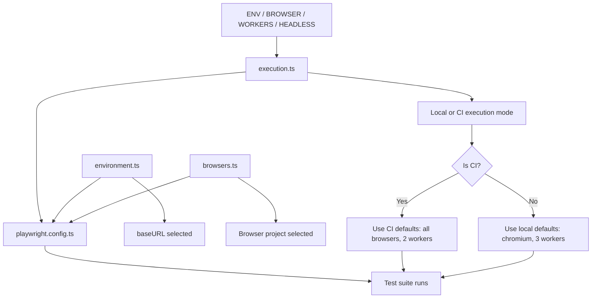

# Playwright Execution Flow

This file explains how the framework decides what to run in local execution and in CI/CD pipeline execution.

## 1. Local execution flow

When a developer runs tests locally:

- `ENV` decides which environment is used.
  - Example: `ENV=qa` selects `qa` URL from `environment.ts`
- `BROWSER` decides which browser to run.
  - Example: `BROWSER=chromium`
  - Example: `BROWSER=chromium,firefox`
- `HEADLESS` decides if browser runs in the background without UI.
  - Default is `true`
- `WORKERS` decides how many tests run in parallel.
  - Default is `3` locally

Example:

- `ENV=stage`
- `BROWSER=firefox`
- `HEADLESS=true`

This will run the suite against the `stage` environment in Firefox in headless mode.

## 2. CI/CD execution flow

In a pipeline, the framework is expected to run in a more controlled and automated way:

- `CI` is detected automatically by the environment.
- `BROWSER` defaults to `all` in CI.
  - This means the full browser matrix is executed automatically.
- `WORKERS` defaults to `2` in CI.
  - This reduces system load and keeps the pipeline stable.
- `HEADLESS` remains enabled by default for faster and stable execution in server environments.

Example:

- `CI=true`
- `ENV=preprod`
- `BROWSER=all`

This will run the test suite against `preprod` in all supported desktop browsers.

## 3. How the config files work together

1. `environment.ts`
   - Stores all environment URLs.
   - Example: `qa`, `stage`, `preprod`

2. `execution.ts`
   - Reads runtime values from environment variables.
   - Decides the active environment, browser(s), workers, and headless mode.

3. `browsers.ts`
   - Defines the browser project setup for Playwright.
   - Example: `chromium`, `firefox`, `webkit`

4. `playwright.config.ts`
   - Uses the runtime settings and browser definitions.
   - Builds the final list of projects for execution.
   - Determines the base URL for every test.

## 4. Simple summary

- Local run = developer-controlled settings
- CI run = pipeline-friendly defaults
- Browser selection = dynamic via `BROWSER`
- Environment selection = dynamic via `ENV`
- Execution scale = controlled via `WORKERS`

This design keeps the same test suite reusable across local validation and automated pipeline runs.

## 5. Important notes for the team

- The `||` operator is used as a fallback check.
  - Example: `process.env.ENV || "qa"`
  - If `ENV` is set, it is used.
  - If it is missing, the framework falls back to `qa` automatically.

- `baseURL` is built from the selected environment, not from a hardcoded page URL.
  - This keeps test scripts portable across QA, staging, and preprod.

- The browser list is controlled through `BROWSER`.
  - Single browser: `BROWSER=chromium`
  - Multiple browsers: `BROWSER=chromium,firefox`
  - Full matrix: `BROWSER=all`

- Local execution is intentionally visible by default.
  - This helps developers debug UI issues manually.
  - CI execution stays headless for stable automated runs.

- Worker count is tuned for environment type.
  - Local: more parallelism for speed.
  - CI: fewer workers to reduce resource pressure.

- This configuration is built for reusable automation across both manual debugging and pipeline execution.
  - Same test suite
  - different envs
  - different browsers
  - different execution modes

### Simple rule to remember

- `ENV` decides where the app runs.
- `BROWSER` decides which browser runs it.
- `WORKERS` decides how many tests run together.
- `HEADLESS` decides whether the browser is visible or hidden.

### What `||` does in these config values

The `||` operator is a fallback mechanism in JavaScript.

Examples:

- `process.env.ENV || "qa"`
  - If `ENV` is set, it wins.
  - If not, the framework automatically uses `qa`.

- `process.env.BROWSER || (isCI ? "all" : "chromium")`
  - If `BROWSER` is set, that browser is used.
  - If not, CI uses `all` and local runs default to `chromium`.

- `process.env.WORKERS ?? (isCI ? 2 : 3)`
  - `??` means use the left value only when it is not `null` or `undefined`.
  - If the value is missing, it falls back to the CI/local default.

This makes the framework easier to manage and much more CI/CD friendly.
